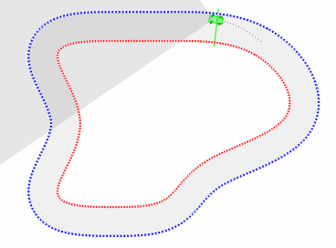
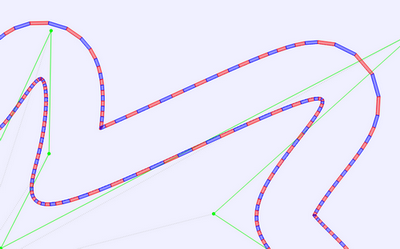
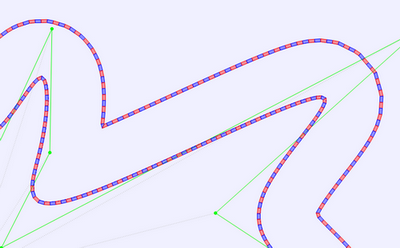
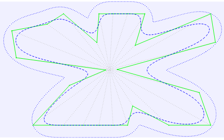
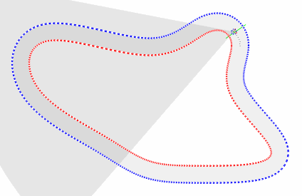
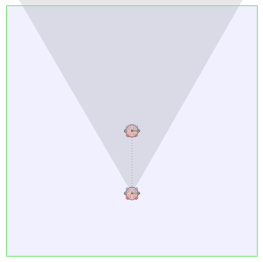
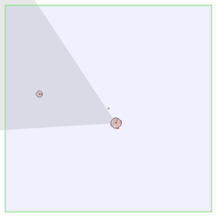
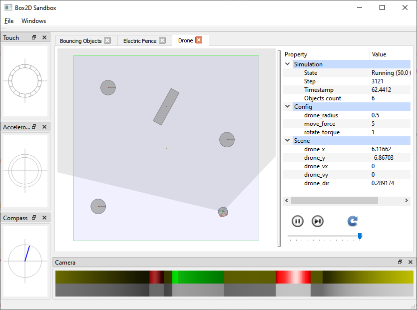
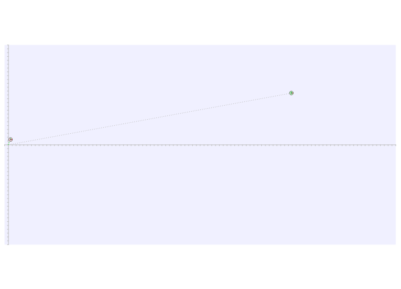
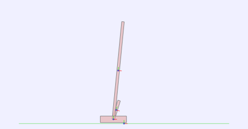

## Dec 11th, 2020

The new `notebooks` subdirectory contains a few examples of using Darwin's 
Python API as Jupyter notebooks. Thanks to [Binder](https://mybinder.org),
an interactive copy of these notebooks is one click away.

## Dec 9th, 2020

Darwin is now on PyPI: https://pypi.org/project/darwin-framework !

This means that if you're on Linux or Windows (sorry, no macOS packages yet),
getting it is as simple as:

`pip install darwin-framework`

## Dec 2nd, 2020

Python bindings are now supported on Windows (MSVC++) too.

## Nov 29th, 2020

Experimental Python bindings!

Currently available only on Linux, check out the [setup instructions][12]
and a basic [intro / tutorial][13].

## Feb 2nd, 2020

Last year I gave a talk about the Darwin Framework at a Seattle area 
[C++ meetup](https://nwcpp.org/Aug-2019.html). Here is [slide deck][11] I prepared for 
the talk, in case anyone is curious.

## Dec 21st, 2019

It took a bit longer than expected, but the car version of the race track domain is
here. The car controls are more restricted compared to the drone and this variation seems
quite a bit challanging. Both CGP and NEAT manage to evolve reasonable car controllers
(the capture below is NEAT after ~350 generations)

## Dec 18th, 2019

A small detour through the land of splines and generating random race tracks. The new
implementation is significantly more robust (ex. no more self intersections for complex
tracks). The spline & outline offset computation is now encapsulated in math::Outline.

Spline sampling before and after implementing equidistant points (before/after):

 

The new math::Outline based implementation results in much cleaner tracks:

## Nov 30th, 2019

[drone_track][10] is a new domain starring the drone, this time racing around a 
track.

Consistent with the rest of the built-in domains implemented in Darwin, the
test tracks are procedurally generated, which means that the trained model can't simply
"memorize" the track layout and has to generalize (procedural environment generation 
proves to be a great answer to overfitting)

## Nov 13th, 2019

Another drone-based domain: [drone_follow][9]. Follow another drone which moves on a
random path (keeping a fixed distance). The only inputs are drone's sensors (camera plus
optionally touch, compass or accelerometer sensors)

## Nov 10th, 2019

New domain: [drone_vision][8] created using the new sim::Scene & associated building
blocks (sim::Camera, sim::Drone). The agent's goal is to "simply" track a bouncing ball
using only the camera pixels.

## Oct 5th, 2019

A new `experimental` directory is the place for subprojects which are not strictly
required in order to build & run Darwin experiment. The first such project is a simple
sandbox intended to help with prototyping 2D-physics environments. 

Part of this sandbox (`experimental/2d_physics`), Box2D was extended with support for 
minimal visual attributes (ex. object color/material) and a few sensors:

- TouchSensor: contact information
- Accelerometer: linear and angular acceleration
- Compass: heading information (in the object local coordinates)
- Camera: a simple 2d raytracer providing color and depth channels

## Jun 14th, 2019

New domain: [ballistics][6]. Given the (x, y) coordinates of the target, output the aim
angle required to hit the target (initial velocity is fixed). The analytical [solution][7]
is not exactly trivial and both CNE and NEAT struggle to solve this seemingly simple 
problem.

## Mar 16th, 2019

A new tournament implementation: [Swiss Tournament][5]

## Feb 23rd, 2019

Various additions to the CGP implementation:
- [CGP genotype exporter](scripts/docs/scripts.md#cgp_genotype_exporterpy)
- Support for multiple selection algorithms
- Evolvable constants
- Stateful functions
- A simple one-point crossover operator

## Feb 1st, 2019

New population: a basic [Cartesian Genetic Programming (CGP)](https://www.cartesiangp.com)
implementation.

## Jan 17th, 2019

Yet another take on inverted pendulums: this time the pole is attached to a wheel
and the agent tries to keep the pole balanced by applying torque to the wheel, similar
to riding an unicycle.

It also introduces an additional goal: keep the unicycle close to a random target
position. This is rewarded by a fitness bonus inversely proportional to the absolute
distance from the target (but only if the pole is balanced for the whole episode)

## Jan 16th, 2019

New domain: [double-cart-pole][4]. This is a more difficult variation of the single-pole
balancing problem.

## Jan 5th, 2019

New domain: the classic cart-pole control theory benchmark problem (also known as "pole
balancing" or "inverted pendulum")

This is the first domain implementation to take advantage of third_party/box2d. Using a 
complex physics engine for this problem is arguably an overkill, although it does allow
a wide range of interesting variations. For example the current implementation exposes the
following configuration knobs:

- world gravity
- pole length and density
- cart density and friction
- discrete vs continuous force applications

For more information, see the cart_pole domain
[documentation][3].

## Dec 27th, 2018

Adding experimental support for the [Box2d](http://box2d.org) physics engine 
(third_party/box2d).

## Dec 21st, 2018

Updating and restructuring the documentation.

## Dec 9th, 2018

Added a rudimentary support for batching experiment runs in Darwin Studio. The
"experiment run dialog" allows setting the number of batch runs (default is 1) and
also a `max_generations` limit:

This has the same effect as repeatedly running the same experiment variation multiple
times, and the result of each run is recorded as a separate `trace` pointing to the same
parent variation.

The aggregated results can be visualized using the new 
[batch_fitness.py](scripts/docs/scripts.md#batch_fitnesspy) script.

## Nov 23rd, 2018

Added [core::PropertySetVariant<TAG>][1] and the corresponding support in
[core_ui::PropertiesWidget][2]:

The intention is to allow sub-modules (for example multime tournament 
implementations) to define their specific configurations.

## Nov 11th, 2018

Initial release

[1]: https://tlemo.github.io/darwin/classcore_1_1_property_set_variant.html
[2]: https://tlemo.github.io/darwin/classcore__ui_1_1_properties_widget.html
[3]: https://tlemo.github.io/darwin/classcart__pole_1_1_cart_pole.html
[4]: https://tlemo.github.io/darwin/classdouble__cart__pole_1_1_double_cart_pole.html
[5]: https://tlemo.github.io/darwin/classtournament_1_1_swiss_tournament.html
[6]: https://tlemo.github.io/darwin/classballistics_1_1_ballistics.html
[7]: https://en.wikipedia.org/wiki/Projectile_motion
[8]: https://tlemo.github.io/darwin/classdrone__vision_1_1_drone_vision.html
[9]: https://tlemo.github.io/darwin/classdrone__follow_1_1_drone_follow.html
[10]: https://tlemo.github.io/darwin/classdrone__track_1_1_drone_track.html
[11]: https://docs.google.com/presentation/d/13ppNNKvsLxe4W_CgGO8THQArsma8colxh-cEzRWkUCE/edit?usp=sharing
[12]: docs/python.md
[13]: bindings/python/docs/tutorial.md
