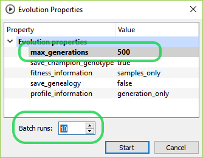

## Jan 5th, 2019

New domain: the classic cart-pole control theory benchmark problem (also known as “pole
balancing” or “inverted pendulum”)

This is the first domain implementation to take advantage of third_party/box2d. Using a 
complex physics engine for this problem is arguably an overkill, although it does allow
a wide range of interesting variations. For example the current implementation exposes the
following configuration knobs:

- world gravity
- pole length and density
- cart density and friction
- discrete vs continuous force applications

For more information, see the cart_pole domain
[documentation](https://tlemo.github.io/darwin/classcart__pole_1_1_cart_pole.html).

## Dec 27th, 2018

Adding experimental support for the [Box2d](http://box2d.org) physics engine 
(third_party/box2d).

## Dec 21st, 2018

Updating and restructuring the documentation.

## Dec 9th, 2018

Added a rudimentary support for batching experiment runs in Darwin Studio. The
"experiment run dialog" allows setting the number of batch runs (default is 1) and
also a `max_generations` limit:

This has the same effect as repeatedly running the same experiment variation multiple
times, and the result of each run is recorded as a separate `trace` pointing to the same
parent variation.

The aggregated results can be visualized using the new 
[batch_fitness.py](scripts/docs/scripts.md#batch_fitnesspy) script.

## Nov 23rd, 2018

Added [core::PropertySetVariant<TAG>][1] and the corresponding support in
[core_ui::PropertiesWidget][2]:

The intention is to allow sub-modules (for example multime tournament 
implementations) to define their specific configurations.

## Nov 11th, 2018

Initial release

[1]: https://tlemo.github.io/darwin/classcore_1_1_property_set_variant.html
[2]: https://tlemo.github.io/darwin/classcore__ui_1_1_properties_widget.html

