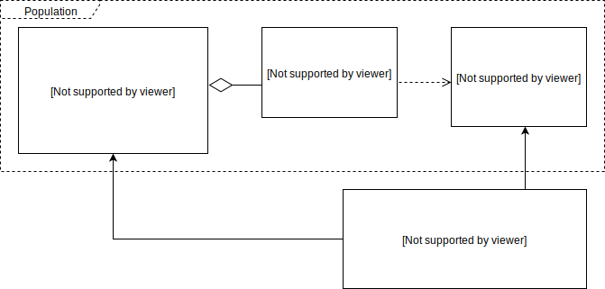

# Darwin Neuroevolution Framework

Darwin is a framework intended to make Neuroevolution experiments easy, quick and fun. It
provides building blocks, samples and tooling to avoid the repetitive (and potentially
complex) scaffolding required to research new ideas.

The current implementation is a combination of portable C++ (running on Linux,
Windows and macOS), augmented by a collection of Python scripts for post-processing
recorded evolution traces.

## Getting Started

- [Setup Instructions](docs/setup.md)
- [Contributing](CONTRIBUTING.md)

## Evolutionary Algorithms and Neuroevolution

[Evolutionary Algorithms][3] are a class of nature-inspired algorithms based on the idea
that a few basic mechanisms, loosely inspired by biological evolution (selection,
reproduction and mutation) can be the building blocks for efficient searches in complex
problem spaces. In particular, we can use [Evolutionary Algorithms][3] to train artificial
neural networks: [Neuroevolution][2].

Starting with a random initial _population_, we seek to evolve towards better solutions in
a iterative fashion: each iteration (_generation_) attempts to combine (_crossover_) the
most promising traits (_selection_) from the previous one, occasionally making random
tweaks (_mutation_):


At a high level, the generic structure of an evolutionary algorithm can be as simple as:

```python
    initialize_population
    while(not satisfied):
        for_each individual:
            evaluate_fitness
        next_generation:
            select_parents
            use crossover & mutation to generate children
```

This conceptual simplicity makes Evolutionary Algorithms attractive and easy to implement,
although creating interesting domain-specific fitness functions and supporting a
structured experimentation approach requires a lot of scaffolding: persisting experiment
variations and results, visualizations, reports, profiling. This is where the Darwin
Framework comes in.

## Darwin Neuroevolution Framework Overview

At the highest level, the core concepts are the [Domain] and the [Population]. The former
describes what we're trying to solve, while the latter encapsulates the solution model(s)
together with the specific evolutionary algorithm(s) used to search for better solutions.

The [Domain] and [Population] interfaces intentionally decouple the two concepts: domains
don't know anything about the details of a particular population implementation, and the 
only thing a population knows about a domain is the number of inputs and outputs.

#### Domains

A [Domain] implementation defines the problem space: the "shape" of a solution (the number
of inputs & outputs) and how to assign a fitness value to a particular solution.

In our case, a solution instance is encoded as a [Genotype] and it's evaluated indirectly
through its phenotypic expression (the corresponding [Brain]).

For example, [Pong] is a domain implementation which simulates the classic 2-player 
arcade game. It defines 6 inputs + 2 outputs, and it calculates the fitness of every
genotype in the population based solely on the results of a tournament between the
population individuals themselves (so the evolved solutions don't incorporate any a priori
knowledge of what a good game play looks like)

#### Populations

A [Population] is simply a set of [Genotypes][Genotype], together with the ability to 
generate new generations (after a [Domain] implementation evaluates and assigns fitness 
values to all the individual genotypes in the population)

The [Genotype] is an encoding for a particular solution and the "recipe" to construct the
corresponding [Brain] (the "phenotype") with the number of inputs and outputs specified by
the domain selected in the active experiment.

#### Summary

Here's how all these pieces fit together:



Using these interfaces, the general structure of the evolution driver code is illustrated
below (this evolution top loop, with a few additions, is provided by the Darwin
Framework so we don't have to re-implement it for every new experiment)

```cpp
population->createPrimordialGeneration(population_size);
while (domain->evaluatePopulation(population)) {
    population->rankGenotypes();
    population->createNextGeneration();
}
```

This is everything required to know in order to experiment with new problems (domains) or
implement new evolutionary algorithms (the populations). Everything else in the Darwin 
Framework exists to provide support for these concepts: persistance for storing experiment
results, UI, tracking and visualizing experiments, common building blocks, tools to
analyze the results, etc.

For additional information see the [full documentation][1].

## Running Experiments & The Universe Database

Every instance of an experiment is persisted in a [Universe] database, which is
implemented as a single Sqlite file. The key data model concepts are:

- [Universe]: the persistent storage for a set of experiments.
- [Experiment]: loosely speaking, a [Domain] / [Population] pair.
- [Variation]: a specific set of configuration values for an experiment.
- [Trace]: the recording of a particular experiment variation run.

Normally, each [Domain] and [Population] implementation comes with a set of configuration
properties which can be edited before starting an experiment. For each set of values
there's a [Variation] associated with the [Experiment]. Every time an experiment variation
is started, a new [Trace] is created to record the history/results of the experiment.

The database schema models the structural relationships, while the actual configuration
values and results are stored as JSON strings (the fields highlighted in green):


## Darwin Studio

Darwin Studio is a visual integrated environment used to create, run and visualize
experiments:


Currently it's the main user-facing tool included in the Darwin Framework, although there
are plans to add additional options (for example a command line driver and/or Python
bindings). For post-processing experiment results there are a few Python
[scripts](scripts/docs/scripts.md) which can parse Darwin universe databases.

## Documentation

- [Implementation Reference][1]
- [Scripts](scripts/docs/scripts.md)
- [Coding Style](docs/coding_style.md)

---

This is not an officially supported Google product.

[1]: https://tlemo.github.io/darwin
[2]: https://en.wikipedia.org/wiki/Neuroevolution
[3]: https://en.wikipedia.org/wiki/Evolutionary_algorithm

[Genotype]: https://tlemo.github.io/darwin/classdarwin_1_1_genotype.html
[Brain]: https://tlemo.github.io/darwin/classdarwin_1_1_brain.html
[Population]: https://tlemo.github.io/darwin/classdarwin_1_1_population.html
[Domain]: https://tlemo.github.io/darwin/classdarwin_1_1_domain.html
[Pong]: https://tlemo.github.io/darwin/classpong_1_1_pong.html
[Universe]: https://tlemo.github.io/darwin/classdarwin_1_1_universe.html
[Experiment]: https://tlemo.github.io/darwin/structdarwin_1_1_db_experiment.html
[Variation]: https://tlemo.github.io/darwin/structdarwin_1_1_db_experiment_variation.html
[Trace]: https://tlemo.github.io/darwin/structdarwin_1_1_db_evolution_trace.html
