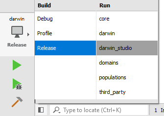

# Setup Instructions

- [General Prerequisites](#general-prerequisites)
- [Getting the Source Code](#getting-the-source-code)
- [Building & Running Darwin Studio](#building--running-darwin-studio)
- [Running the Tests](#running-the-tests)
- [Qt Creator Tips](#qt-creator-tips)
- [Windows](#windows)
- [Linux](#linux)
- [macOS](#macos)

### General Prerequisites

- [Qt 5.x+ and QtCreator 4.x+][3] (_Qt Charts must be selected_)
- [Python 3][4] for running the bundled scripts
- [Doxygen][1] for generating the API documentation

### Getting the Source Code

Darwin source tree uses [Git submodules][5] so add `--recursive` to `git clone`:

`git clone --recursive <Darwin repository>`

Or, the submodules can be initialized after a regular clone:

```
git submodule init
git submodule update
```

> Submodules may change. To avoid having to repeatedly run `git submodule update`:
> - Use `git pull --recurse-submodules` when updating the local repository.
> - Or, you can make it automatic: `git config submodule.recurse true`

### Building & Running Darwin Studio

> First, review the platform-specific instructions below.

1. Open the `darwin.pro` project in Qt Creator (the first time the project is loaded it
    will prompt you to select a kit)

2. Select the `darwin_studio` subproject (Tip: experiments run much faster with the
    `Release` build flavor, although `Debug` provides a better debugging experience)

    

3. `Build / Run` (default keyboard shortcut is Ctrl+R)

### Running the Tests

The recommended way to run Darwin tests is from Qt Creator:
`Tools / Tests / Run All Tests` or from the `Test Results` pane.

For more information see the official Qt Creator's [Autotests][7] documentation.

### Qt Creator Tips

- Use the included `code_style.xml`. See the [Coding style](coding_style.md) notes.
- The default code model diagnostics can be overly noisy. The workaround is to change
    `C++ / Code Model` = `Clang-only checks for questionable constructs`
- If any of the tests timeout (`Debug` builds might hit this), try increasing the value
    for `Options / Testing / General / Timeout`
- Don't forget to select the `Release` build flavor when running the evolution experiments
    (The `Debug` builds provide a better debugging experience but they are much slower)
- If something fails to compile or run, in a bizarre way, run qmake + rebuild
    (Always run qmake on root project after changing Qt forms or signals/slots)
- For selecting a custom build output location, change the default build
    directory under `Tools / Options / Build & Run` (before selecting the kit)

### Windows

- The recommended toolchain is MSVC (Microsoft Visual C++), included with
    [Visual Studio 2017 or newer][2]. The free Community Edition will suffice.

> NOTE: Darwin should build fine with MinGW 7.x+, although this configuration is not
> currently supported. MinGW ships with a [broken][8] std::random_device implementation

### Linux

- Requires GCC 6.x+ 
- In Qt Creator, under `Projects / Build / Build Steps` (_note that you need to do this
    for every build flavor_):
    - Optional (speed up the builds): Set `make / Make arguments` += `-jN`
        (_where N is the number of available CPU cores_)
- If the build fails complaining that `<gl/gl.h>` can't be found, try
    `sudo apt install libgl-dev` (noticed on Ubuntu 18.04)

### macOS

The C++ toolchain included with the current Xcode (10.0) is lacking some of the required 
C++ 17 features and/or libraries. One workaround is to manually install Clang 7.x+:

- Install [Homebrew][6]
- `brew install llvm`
- `brew install doxygen` (Optional, used to build the reference documentation)
- In Qt Creator, under `Projects / Build / Build Steps` (_note that you need to do this
    for every build flavor_):
    - `qmake / Additional arguments` +=  
        `QMAKE_CXX=/usr/local/opt/llvm/bin/clang++`
        `QMAKE_CC=/usr/local/opt/llvm/bin/clang`
        `QMAKE_LIBDIR=/usr/local/opt/llvm/lib`
    - Optional (speed up the builds): Set `make / Make arguments` += `-jN`
        (_where N is the number of available CPU cores_)

[1]: http://www.doxygen.nl
[2]: https://visualstudio.microsoft.com
[3]: https://www.qt.io/download
[4]: https://www.python.org
[5]: https://git-scm.com/book/en/v2/Git-Tools-Submodules
[6]: https://brew.sh
[7]: http://doc.qt.io/qtcreator/creator-autotest.html
[8]: https://sourceforge.net/p/mingw-w64/bugs/338
